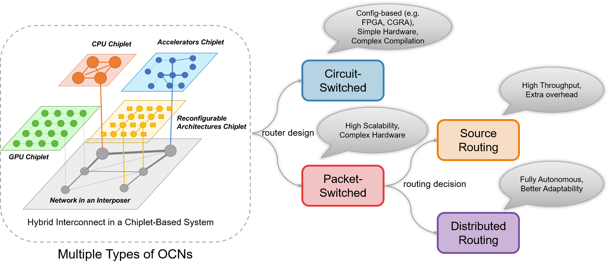

Purlin: A Versatile Toolkit for Programmable On-Chip Network Generation and Simulation
=====================

Purlin is a versatile toolkit for the generation and simulation of programmable OCNs.
We put forward a uniform network generation and simulation flow across distributed
routing, source routing, and circuit-switched OCNs to enable effective
trade-offs.



In this project, we call packet-switched OCNs as NoC, which is more commonly accepted.
And we call circuit-switched OCNs as SwitchBox like which in FPGA.


## Installing Necessary Dependencies

|  Package  |  Version  |
|  :----: | :----: |
| Java  | ≥ 8.0 |
| [Scala](https://www.scala-lang.org/download/)  | ≥ 2.12.10 |
| [Chisel](https://github.com/freechipsproject/chisel3)  | ≥ 3.2.2 |
| [Verilator](https://www.veripool.org/wiki/verilator)  | ≥ 3.916 |

### Installing Scala
Install Scala either by installing an IDE such as IntelliJ, or sbt, Scala's build tool.
You can install sbt in Ubuntu using following command:
 ```Bash
 echo "deb https://dl.bintray.com/sbt/debian /" | sudo tee -a /etc/apt/sources.list.d/sbt.list
 curl -sL "https://keyserver.ubuntu.com/pks/lookup?op=get&search=0x2EE0EA64E40A89B84B2DF73499E82A75642AC823" | sudo apt-key add
 sudo apt-get update
 sudo apt-get install sbt
 ```

It may take a few minutes.

### Installing Chisel
Chisel will be installed automatically according to build.sbt the first time you run sbt.

### Installing Verilator

To install Verilator as a package:
``` shell
sudo apt-get install verilator
``` 

## Project Tree

```
.
├── build.sbt                       //the library dependencies in sbt
├── PurlinTest                      //an empty folder for storing some results
├── README.md 
└── src
    └── main
        └── scala
            └── tetriski
                └── purlin
                    ├── NoC         //modules and testers of packet-switched network
                    ├── SwitchBox   //modules and testers of circuit-switched network
                    └── utils       //some utils, network models and algorithms
```


## Quick Start

1.RTL Generation (in RTL/)

Generate a default 4x4 2-channel distributed routing packet-switched network with 32-bit payload:
``` shell
make genDistributedRouting
``` 

Generate a default 4x4 2-channel source routing packet-switched network with 32-bit payload:
``` shell
make genSourceRouting
``` 

Generate a default 4x4 2-channel circuit-switched network (Fs = 8) with 32-bit payload:
``` shell
make genCircuitSwitched
``` 

2.Running Simulation

Explore a 2-channel 4x4 packet-switched distributed routing network under different injection rate:
``` shell
make testInjectionRate
``` 

Explore suitable parameters and injection rate where other algorithms perform better than XY-routing:
``` shell
make testAlgorithms
``` 

Compare packet-switched and circuit-switched 2-channel 4x4 networks:
``` shell
make testNetworkCompare
``` 
 

3.Result Files

- globalRouting.json / globalRoutingResult.json
   
     The routing tasks or strategies.
        You can refer to utils.JsonIO.scala.

- *-DetailLatency.txt / latencyDistribution.txt

     The detail packet network latency of each packet, or the latency distribution.

- NoCTestingResults.txt

     The details of simulation results for packet-switched networks.
You can refer to NoC.MeshNoCTest.scala.

## Publications

For more detailed information and paper reference, please refer to the following papers:
`Yijiang Guo, Xinming Wei, Jiaxi Zhang and Guojie Luo, 
"Purlin: A Versatile Toolkit for the Generation and Simulation of On-Chip Network",
2022 IEEE International Conference on Computer Design (ICCD), October 2022.`
```
@article{guo-formulating-dac2021,
  title   = "{Purlin: A Versatile Toolkit for the Generation and Simulation of On-Chip Network}",
  author  = {Yijiang Guo and Xinming Wei and Jiaxi Zhang and Guojie Luo},
  journal = {2022 IEEE International Conference on Computer Design (ICCD)},
  month   = {October},
  year    = {2022},
} 
```


